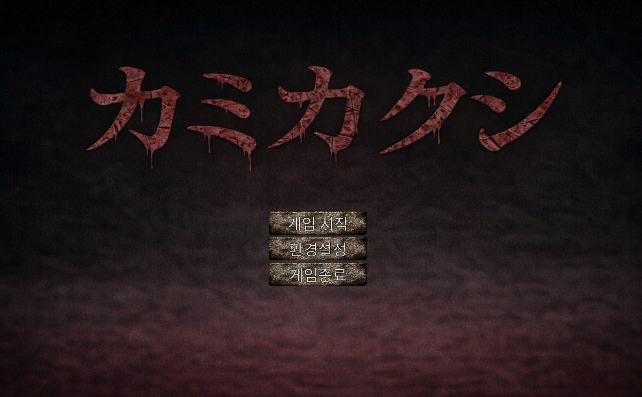
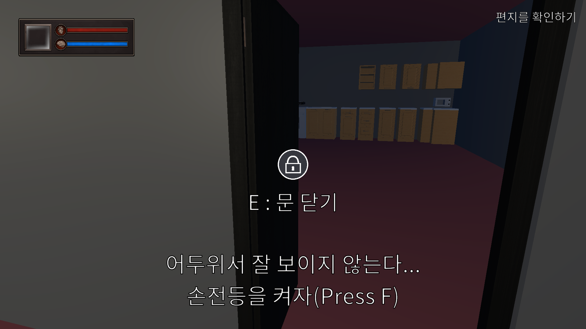
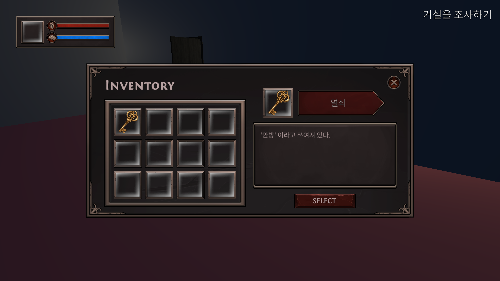

# 프로젝트명

> **Kamikakushi** — Unity 기반 1인칭 호러 어드벤처 팀 프로젝트

## 1. 프로젝트 소개

`Kamikakushi`는 Unity로 개발된 3D 호러 어드벤처 게임 프로젝트입니다. 플레이어는 마을/숲/집 등의 공간을 탐색하며 아이템을 수집하고, 상호작용 오브젝트를 활용해 목표를 단계적으로 달성합니다. 진행 중에는 체력(HP)과 정신력(Sanity) 관리가 필요하며, 선택과 진행 상태에 따라 엔딩 분기가 발생합니다.

- 장르: 1인칭(First-Person) 호러 어드벤처
- 형태: 팀 프로젝트 (25.12.10 ~ 25.12.26 / 2주)
- 핵심 경험: 탐색, 상호작용, 아이템 활용, 생존, 엔딩 분기

## 2. 개발 정보

- 개발 엔진: **Unity 2022.3.62f2 (LTS)**
- 프로젝트 구조:
  - `Assets/_Kamikakushi/Scenes`: 메인 메뉴, 튜토리얼, 빌리지, 포레스트, 엔딩 씬
  - `Assets/_Kamikakushi/Scripts`: 게임 진행, UI, 몬스터, 상호작용, 저장 시스템
  - `Assets/_Kamikakushi/Prefabs`: 플레이어, 몬스터, UI, 오브젝트 프리팹
  - `Assets/_Kamikakushi/Data`: 아이템/읽기 데이터(ScriptableObject)

## 3. 플레이 방식

1. **탐색**: 맵을 이동하며 상호작용 가능한 오브젝트를 찾아 단서를 획득합니다.
2. **상호작용**: 오브젝트에 접근해 조사/사용/획득 등의 행동을 수행합니다.
3. **인벤토리 관리**: 획득한 아이템을 상황에 맞게 사용해 진행을 해금합니다.
4. **생존 관리**: HP/Sanity 상태를 관리하며 몬스터로부터의 위협을 회피합니다.
5. **목표 달성 및 분기**: 목표를 탐색하여 진행도를 갱신하고, 조건에 따라 엔딩이 달라집니다.

## 4. 주요 기능

- **진행 단계(Progress Step) 기반 게임 플로우**
  - 튜토리얼 → 마을 → 숲 → 엔딩 구간으로 이어지는 이벤트 기반 진행
- **상호작용 시스템**
  - 아이템 획득, 오브젝트 활성/비활성, 씬 전환, 조건 검사 등 액션형 인터랙션
- **UI/HUD 시스템**
  - 크로스헤어 프롬프트, 상호작용 결과 표시, 인벤토리, 설정 UI
- **인벤토리 시스템**
  - 슬롯 UI 기반 아이템 동기화, 선택/사용 처리
- **플레이어 상태 시스템**
  - HP/Sanity 수치 반영 및 HUD 연동
- **몬스터 시스템**
  - 몬스터 베이스 클래스 + 타입별 동작 및 추격방식 구현(예: Zombie, Ghoul, Banshee)
- **저장/불러오기 시스템**
  - 진행 상태와 목표(Objective) 복원
- **엔딩 연출**
  - 일반/트루 엔딩 관련 매니저 및 시퀀스 처리

## 5. 팀 구성 및 역할

- **문규성**: `게임 플레이 구현` — 플레이어 조작, 상호작용, 진행 로직 
- **김민재**: `UI` — HUD, 인벤토리, 설정/가독성 개선, 연출
- **이인제**: `몬스터 컨텐츠` — 몬스터 로직
- **최민우**: `기획` — 세계관/레벨 설계, 진행 단계 정의

## 6. 기술 스택

- **Engine**: Unity 2022.3 LTS
- **Language**: C#
- **Rendering**: URP (Universal Render Pipeline)
- **UI**: Unity UI(UGUI), TextMeshPro
- **Navigation**: Unity AI Navigation
- **Cinematics**: Timeline, Cinemachine
- **Version Control**: Git / GitHub

## 7. 실행 방법

### 7.1 실행 절차
1. [최신 릴리즈버전](https://github.com/ks0521/First-Game-Project/releases)을 다운로드합니다.
2. 압축을 해제합니다.
3. 폴더 안의 `KamiKaKushi.exe` 파일을 실행합니다.

## 8. 상세 문서 링크

- 게임 기획서: `[링크 추가]`
- 시스템 설계서: `[링크 추가]`
- 와이어프레임 / UI 문서: `[링크 추가]`
- 트러블슈팅 / 회고: `[링크 추가]`

## 9. 플레이 영상 / 스크린샷

- [플레이 영상](https://youtu.be/v1zOEZXVuqY)
- 스크린샷:

| 장면 | 이미지 |
|---|---|
| 메인 메뉴 |  |
| 탐색 장면 |  |
| 인벤토리 UI |  |

---
  
